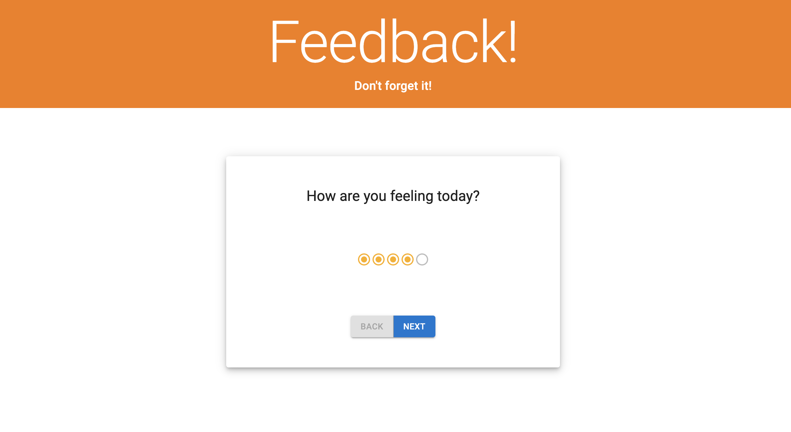
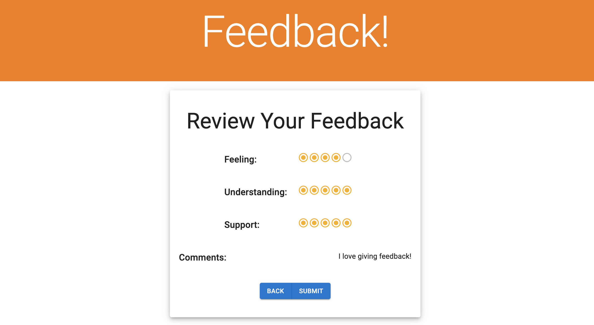
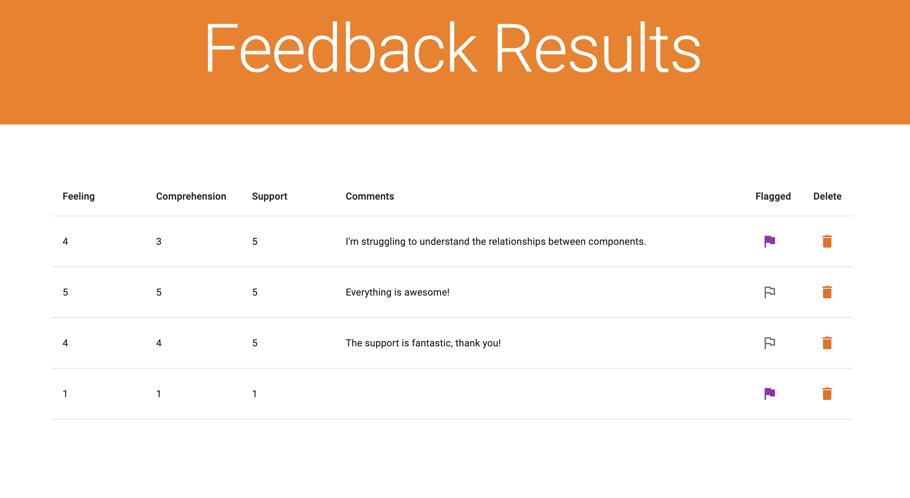

# React Redux Feedback Loop

## Description

_Duration: Weekend Challenge_

This app is a reflection / feedback form that allows users to rate their feeling, comprehension, and perception of support and enter any comments. There is also an admin page where admin users can view feedback provided by users, flag feedback (for further review), or delete specific feedback.

The app uses a [PostgreSQL](https://www.postgresql.org/) database to store the feedback, [Express](https://expressjs.com/) / [Node.js](https://nodejs.org/en/) as a server, and [React](https://reactjs.org/) and [Redux](https://redux.js.org/) on the front end. Styling is provided by [Material-UI](https://mui.com/).

## A note about the code

I enjoyed building this project because it was my first full-fledged app built with redux. Because the feedback forms were all so similar, it also gave me practice in keeping my code DRY: I could reuse the same components (a question page and a header) to which I could pass down a few props to change the way they behave. I could also implement a multi-purpose modal to which I could pass down props; depending on which props were being passed down, the modal displays different options (with either one button or two buttons, conditionally rendered). I also passed down callback functions to the modal which makes the modal more flexible, as the parent component can decide on what actions shoudl be completed on accepting or rejecting the modal.

## Screenshots

_Feedback app rating screen._

_Feedback app review before final submission. Users can navigate back from this page to adjust their feedback._

_Feedback app admin page where admin users can review all feedback given, flag feedback for future review, and delete specific feedback._

## Prerequisites

- [Node.js](https://nodejs.org/en/)
- [PostgreSQL](https://www.postgresql.org/)

## Installation

1. After cloning this repository, set up a PostgreSQL database called `prime_feedback` on port 5432. You might want to use [Postico](https://eggerapps.at/postico/) as a GUI to help this setup process.
2. Use the commands in the `data.sql` file in the root directory of the project to set up a table in the database with some dummy data.
3. Run `npm install` to install dependencies in this project.
4. Run `npm server start` to start the server, which will run on port 5000.
5. Run `npm client start` to start the client, which will run on port 3000.
6. Running the client should open up a browser window to `localhost:3000` where you can view and use the app. You can also manually type in this address in your browser.

## Usage

1. Navigating to `localhost:3000/` will start the feedback process. Select the rating that you would like to give for each of the three categories (feeling, understanding, and support) by clicking on the rating bar and then clicking on the "next" button. Optionally, you can use the keyboard by pressing tab until the rating bar is in focus, adjusting the rating with the arrow keys, pressing tab until the "Next" button is in focus, and pressing Enter.
2. Each of the three categories need to be given a rating. The "Next" button will be disabled for each category until that category is given a rating.
3. You can always opt to change a rating or comments provided previously by navigating backward with the "Back" button.
4. Once all the categories have ratings and comments have optionally been provided, you will land on the review page, where you can review the feedback before final submission. From here, you can always navigate backward to adjust the feedback in any of the four categories.
5. You will not be able to submit the feedback if the first three categories have not been rated—in that case, the "Submit" button will be disabled.
6. After reviewing your feedback, select "Submit" to submit the feedback.
7. You will be taken to a screen notifying you that your feedback has been captured, and offering the chance to provide new feedback by selecting the "Leave New Feedback" button.
8. Admin users will have access to all the feedback by navigating to `localhost:3000/#/admin`.
9. Here, admin users can review all the feedback given in a table.
10. Admin users can toggle whether a post should be flagged by clicking on the "flag" icon in the "Flagged" column. A gray, empty flag will indicate that the feedback has not been flagged.
11. Admin users can delete specific feedback by clicking on the "trash can" icon in the "Delete" column. A confirmation modal will pop up asking the user to confirm the attempt to delete the feedback. Selecting "Delete" will permanently remove the feedback.

## Built With

1. [Node.js](https://nodejs.org/en/)
2. [Express](https://expressjs.com/)
3. [React](https://reactjs.org/)
4. [Redux](https://redux.js.org/)
5. [PostgreSQL](https://www.postgresql.org/)
6. [Material-UI](https://mui.com/)
7. [axios](https://www.npmjs.com/package/axios)
8. HTML
9. CSS

## Acknowledgement

Thanks to [Prime Digital Academy](www.primeacademy.io) who equipped and helped me to make this application a reality.
